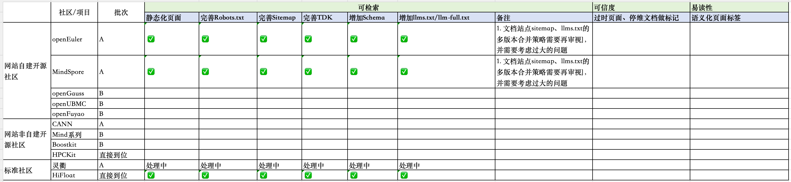

# Progress

## GEO

处理策略：

1. 文档暂不生成descrption、keywords、schema；
2. 涉及文案类初稿由AI生成、skill限制说明来源只能是页面内容，然后开发review+运营review；
3. 确定性的逻辑需封装为[脚本](https://github.com/opensourceways/OpenDesignPlus/tree/dev/packages/plugins/src)

## MCP

1. openEuler：https://gitcode.com/openeuler/openEuler-portal-mcp
2. openUBMC：https://atomgit.com/persimmonzzz/openUBMC-portal-mcp

